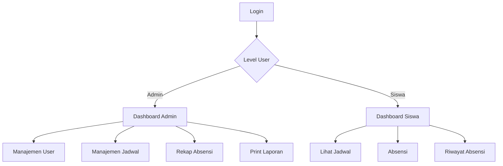

# SiHadir

Aplikasi Absensi Siswa & Manajemen Jadwal Berbasis Laravel

---

## 📋 Deskripsi Singkat
SiHadir adalah aplikasi absensi siswa dan manajemen jadwal kelas berbasis web, dikembangkan dengan Laravel. Aplikasi ini mendukung autentikasi multi-level (admin & siswa), absensi online, rekap absensi, manajemen user, dan tampilan modern dengan tema orange/kuning glassmorphism.

---

## 🗺️ Diagram Alur Aplikasi



---

## 🛠️ Teknologi yang Digunakan

| Teknologi         | Kegunaan                                                                 |
|-------------------|--------------------------------------------------------------------------|
| Laravel           | Framework utama backend PHP, routing, MVC, ORM, autentikasi, migrasi     |
| Laravel Breeze    | Starter kit autentikasi sederhana (login, register, session)             |
| MySQL/MariaDB     | Database relasional untuk menyimpan data user, absensi, jadwal           |
| Composer          | Manajer dependency PHP                                                   |
| NPM & Node.js     | Manajer dependency frontend, build asset (JS, CSS)                       |
| Vite              | Build tool modern untuk asset frontend (JS, CSS)                         |
| Tailwind CSS      | Framework CSS utility-first untuk styling responsif & modern              |
| Chart.js          | Library visualisasi grafik absensi di dashboard                          |
| Font Poppins      | Font utama untuk tampilan modern                                         |
| Git & GitHub      | Version control & kolaborasi kode                                        |
| Glassmorphism CSS | Efek visual modern pada card, navbar, dan elemen UI                      |

---

## 🚀 Fitur Utama
- **Autentikasi**: Login/register dengan username, level user (admin/siswa)
- **Manajemen User (Admin)**: Lihat, rekap, dan hapus user
- **Manajemen Jadwal Kelas**: Tambah, edit, hapus jadwal kelas
- **Absensi Siswa**: Siswa absen sesuai jadwal, validasi 1x/hari/jadwal
- **Rekap Absensi**: Admin bisa lihat rekap absen per siswa, print laporan
- **Dashboard Modern**: Tema orange/kuning, glassmorphism, animasi, responsive
- **Tombol Navigasi Cepat**: Kembali ke dashboard di semua halaman utama

---

## ⚡️ Cara Instalasi & Menjalankan Project

### 1. **Clone Repository**
```bash
https://github.com/username/SiHadir.git
cd SiHadir
```

### 2. **Install Dependency PHP**
```bash
composer install
```

### 3. **Copy File .env & Generate Key**
```bash
cp .env.example .env
php artisan key:generate
```

### 4. **Atur Konfigurasi Database**
Edit file `.env` dan sesuaikan:
```
DB_DATABASE=namadb
DB_USERNAME=root
DB_PASSWORD=
```

### 5. **Migrasi & Seeder Database**
```bash
php artisan migrate --seed
```

### 6. **Install Dependency Frontend**
```bash
npm install
npm run dev
```

### 7. **Jalankan Server**
```bash
php artisan serve
```
Akses di browser: [http://localhost:8000](http://localhost:8000)

---

## 👤 **Akses Admin & Siswa**
- **Admin**: Bisa mengelola user, jadwal, rekap absen semua siswa
- **Siswa**: Hanya bisa absen, lihat jadwal, dan riwayat absensi sendiri

---

## 🗂️ **Penjelasan Fitur**
### 1. **Dashboard Admin**
- Navigasi ke Manajemen User, Rekap Absen Siswa, Jadwal Kelas
- Statistik dan info penting (bisa dikembangkan)

### 2. **Manajemen User**
- Lihat semua user (admin & siswa)
- Hapus user
- Reset password user (opsional)

### 3. **Manajemen Jadwal Kelas**
- Tambah, edit, hapus jadwal kelas
- Jadwal tampil di dashboard siswa dan form absensi

### 4. **Absensi Siswa**
- Siswa hanya bisa absen 1x per hari per jadwal
- Validasi otomatis, notifikasi sukses/gagal

### 5. **Rekap Absensi**
- Admin bisa lihat rekap absen per siswa (card)
- Detail rekap bisa di-print (PDF)

### 6. **Tampilan Modern**
- Tema orange/kuning, glassmorphism, animasi fade-in, responsive
- Font Poppins, tombol modern, card informatif

---

## 💡 **Catatan**
- File `.env` dan folder `vendor/` tidak ikut di repo (keamanan & efisiensi)
- Untuk data dummy, bisa gunakan seeder atau input manual
- Jika ingin deploy ke hosting, pastikan environment sudah support Laravel

---

## 📞 **Kontribusi & Kontak**
Silakan fork, pull request, atau hubungi developer jika ingin kontribusi atau ada pertanyaan!
